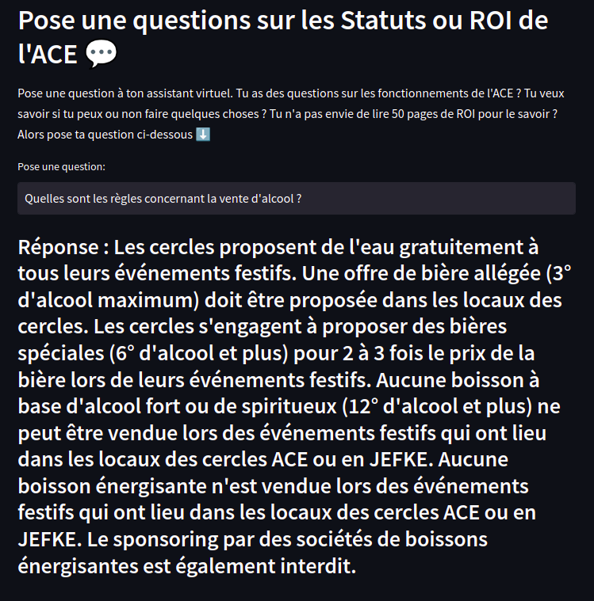
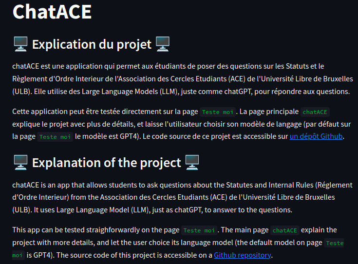
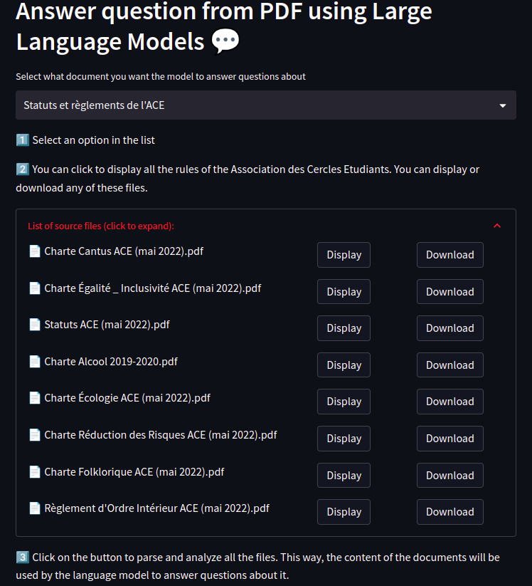
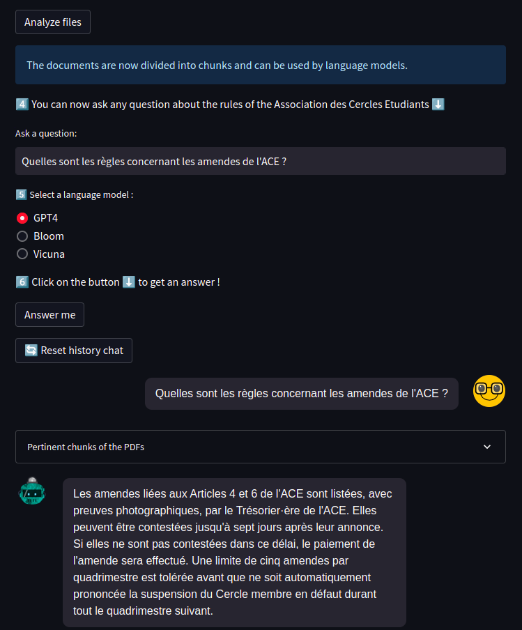

# ChatACE
Repository for the course INFO-H512 current trends of AI. 

Purpose : use Large Language model to answer questions from the Statutes and Internal Rules of the Association des Cercles Etudiants.

## Use

This project is hosted on Streamlit Community Cloud at the address : [chat-ace.streamlit.app](https://chat-ace.streamlit.app/)

Alternatively, you can also run it locally by following the instructions. However, this solution requires some API keys.


#### Setup 
Get an OpenAI, an HuggingFace and a Replicate API keys and write them in a file `.streamlit/secrets.toml`. The OpenAI's API key is required, else the embeddings cannot be retrieved. If the HuggingFace's or Replicate's API is missing, then the associate Language Model will not be usable.
```
export OPENAI_API_KEY='sk-XXXXXXXXXXXXXXXXXXXXXXXXXXXXXXXXXXXXXXXXX'
export API_KEY_HuggingFace='hf_YYYYYYYYYYYYYYYYYYYYYYYYYYYYYYYYYYYY'
export REPLICATE_API_TOKEN = r8_ZZZZZZZZZZZZZZZZZZZZZZZZZZZZZZZZZZZ'
```

Install the requirements : 
```
pip install -r requirements.txt
```

#### Run
After install `streamlit`, run the app using 

```
streamlit run chatACE.py
```
You can then access to [http://localhost:8501/](http://localhost:8501/) from your navigator.


## Screenshots
Page `Teste-moi`


Page `Explications - Explanations`


Page `chatACE` (main page)

